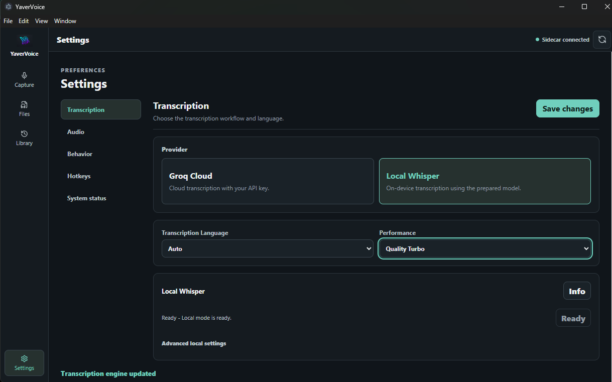

<p align="center">
  
</p>

<h1 align="center">YaverVoice</h1>

<p align="center">Desktop speech-to-text with Groq Cloud or Local Whisper.</p>

<p align="center">
  <a href="https://github.com/vibeeeng/YaverVoice/actions/workflows/ci.yml"></a>
  <a href="https://github.com/vibeeeng/YaverVoice/releases"></a>
  
  <a href="LICENSE"></a>
</p>

> [!IMPORTANT]
> `v0.1.0-beta.1` is a public beta. Windows x64 installer and portable builds are available, but they are not code-signed yet and may trigger Microsoft Defender SmartScreen. Linux is supported from source.

YaverVoice is an Electron desktop application backed by a local Python sidecar. It records microphone audio, transcribes files, keeps current-session history, creates Markdown notes, converts audio formats, and provides a compact Quick Dictation window.



## Features

- Groq Cloud transcription and optional on-device Local Whisper
- Microphone recording, file transcription, long-file splitting, and Quick Dictation
- Optional English translation
- Current-session transcript history with copy, edit, merge, and save actions
- Markdown document generation through Groq
- FFmpeg-based conversion and optional audio cleanup
- Windows and Linux desktop platform layers
- No telemetry or analytics

## Downloads

Download the Windows x64 beta from the [`v0.1.0-beta.1` release](https://github.com/vibeeeng/YaverVoice/releases/tag/v0.1.0-beta.1):

- **Setup:** recommended for a normal Windows installation
- **Portable:** runs without installation
- **SHA256SUMS.txt:** verifies the downloaded executables

The Windows package includes the Local Whisper runtime dependencies, but not a speech model. YaverVoice downloads the selected model only after you explicitly prepare Local Whisper from Settings. Linux users should follow the source setup below.

## Requirements

- Node.js 24 with npm 11 or newer
- Python 3.10+ (Python 3.12 is recommended; CI covers 3.10 and 3.12)
- A working microphone for recording features
- Optional: FFmpeg/FFprobe for conversion, additional formats, splitting, and cleanup
- Optional: a Groq API key for Groq Cloud transcription and Docs

## Quick start

Clone the repository and install the locked Node dependencies:

```bash
git clone https://github.com/vibeeeng/YaverVoice.git
cd YaverVoice
npm ci
```

Create a Python environment and install runtime dependencies.

Windows PowerShell:

```powershell
py -3.12 -m venv venv
.\venv\Scripts\Activate.ps1
python -m pip install -r requirements.txt
```

If Python 3.12 is unavailable, the supported Python 3.10 launcher command is `py -3.10`.

Linux:

```bash
python3 -m venv venv
source venv/bin/activate
python -m pip install -r requirements.txt
```

On Ubuntu/Debian, install the native audio/desktop helpers first: `sudo apt install python3-venv portaudio19-dev xclip`. Add `ffmpeg` when using conversion, extended formats, splitting, or cleanup. Wayland environments may limit global hotkeys and simulated paste.

Start the desktop app:

```bash
npm run desktop:dev
```

## First run

The app starts without a Groq key. Choose the workflow you want in **Settings**:

- **Groq Cloud:** select Groq and enter your Groq API key. A key is also required for Docs generation.
- **Local Whisper:** stop the app, install the local runtime, restart YaverVoice, select Local Whisper, and click **Set Up Local Mode**.

Install the Local Whisper runtime in the active Python environment with:

```bash
python -m pip install -r requirements-local.txt
```

Local setup downloads the selected Whisper model only after you click **Set Up Local Mode**, so the first setup needs an internet connection. Later transcription uses the cached on-device model and does not require `GROQ_API_KEY`. Packaged Windows builds already contain the Local Whisper runtime, but deliberately do not contain or silently download a model.

For conversion, additional formats, long-file splitting, and audio cleanup, install FFmpeg and make sure both commands are available on `PATH`:

```bash
ffmpeg -version
ffprobe -version
```

## Privacy and API keys

- Local Whisper processes transcription audio on your device.
- Groq Cloud transcription sends the selected audio directly to Groq using your API key.
- Docs sends transcript text to Groq even when Local Whisper produced that transcript.
- YaverVoice has no telemetry or analytics.
- The beta stores the Groq API key as plaintext in the user app-data `.env` file. POSIX systems apply mode `0600`; Windows relies on the user app-data ACL.
- Temporary cleanup/upload copies are removed after processing. App-created recordings and split chunks remain for current-session History and are removed during graceful sidecar shutdown.

Read [PRIVACY.md](PRIVACY.md) before using cloud features. Groq’s current retention and Zero Data Retention options are described in [Groq’s data documentation](https://console.groq.com/docs/your-data).

## Audio cleanup and RNNoise

`Off` and `Normal` work without an RNNoise model. `Noisy` and `Severe` require FFmpeg with the `arnndn` filter and a `.rnnn` model that you select manually. YaverVoice does not download an RNNoise model automatically; only use a model whose source, license, and integrity you trust.

## Validation

```bash
python -m unittest discover -s tests
npm run desktop:typecheck
npm audit --audit-level=high
```

## Build Windows EXEs

Windows builds require Node.js 24, npm 11+, Python 3.10 or 3.12, and the locked Node dependencies. From a fresh PowerShell checkout:

```powershell
py -3.12 -m venv venv
.\venv\Scripts\Activate.ps1
python -m pip install -r requirements.txt -r requirements-local.txt -r requirements-build.txt
npm ci
npm run build:windows
```

The build creates an NSIS installer and a portable executable under `dist-electron/`. `build.ps1` also packages `YaverVoiceSidecar.exe`, verifies that Local Whisper imports from the packaged sidecar, and fails with an actionable message when a required build dependency is missing.

Locally built artifacts are unsigned, so Windows may show a Microsoft Defender SmartScreen warning. The initial public beta does not publish official binaries; signing, binary-license, SBOM, and provenance review remain release requirements.

## Contributing and security

Issues and focused pull requests are welcome. Read [CONTRIBUTING.md](CONTRIBUTING.md) and the [Code of Conduct](CODE_OF_CONDUCT.md). Please report vulnerabilities privately as described in [SECURITY.md](SECURITY.md), not in a public issue.

## License and trademarks

The source code is licensed under the [GNU General Public License v3.0 only](LICENSE). Dependencies keep their own licenses; see [THIRD_PARTY_NOTICES.md](THIRD_PARTY_NOTICES.md).

The GPL does not grant permission to present unofficial forks as official YaverVoice releases or to use the YaverVoice name/logo in a confusing way. See [TRADEMARKS.md](TRADEMARKS.md).
